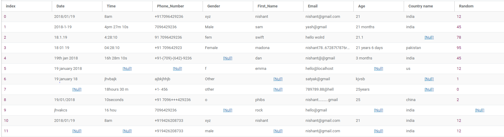
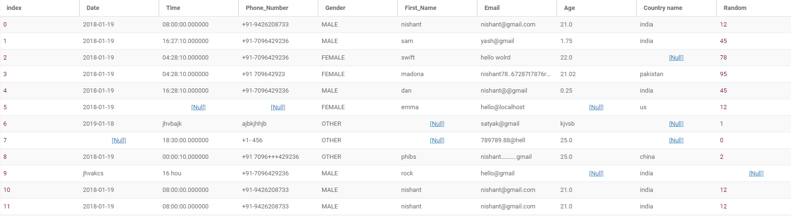
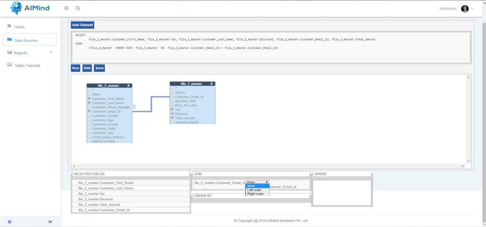
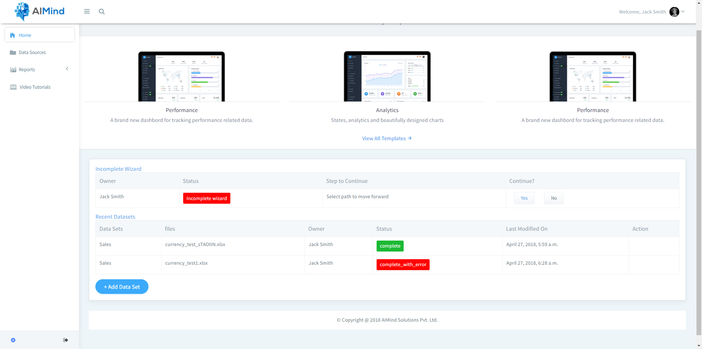
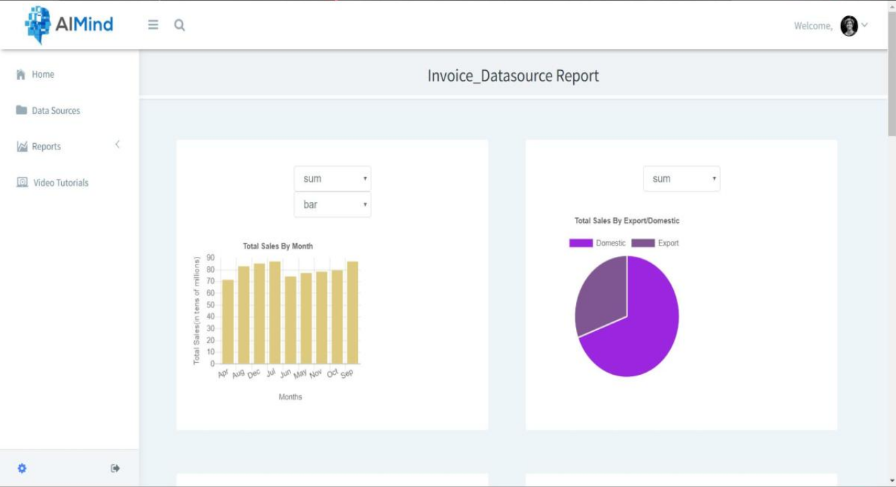

# Dynamic ETL and Statistical Dashboard

### A web application that automates analyitics on datasets via ETL pipeline using Django Framework.

[Demo of the Project](https://www.loom.com/share/e379a633b9b54616a2a05bf0ce5ac88f)

* Original Data

* Data after the application cleans it

* Combine two datasets using user interface or sql query using this datasource generator tool

* Dashboard shows all the activities performed by the user

* Statistical Report

